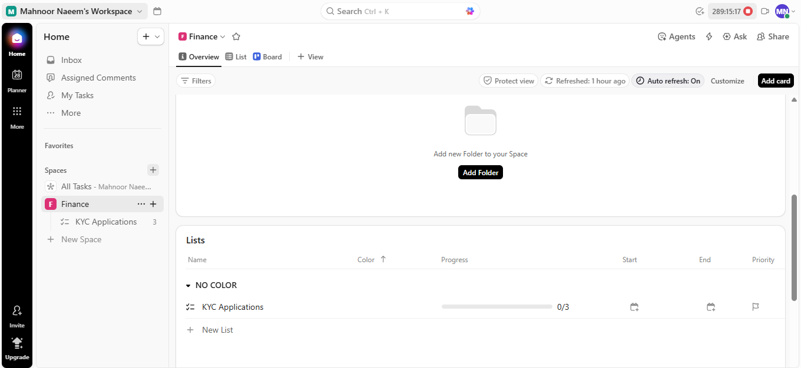
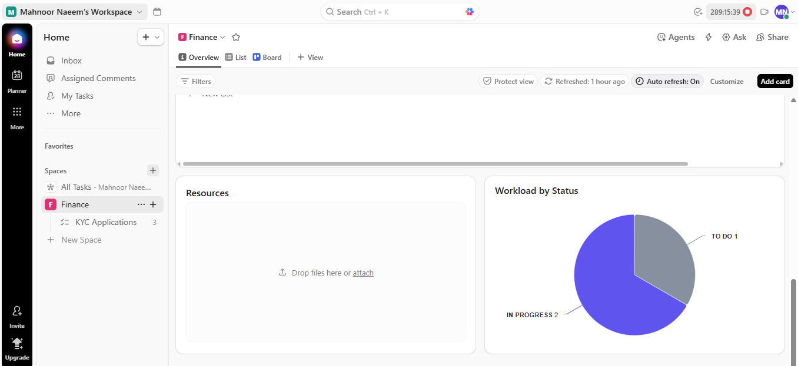
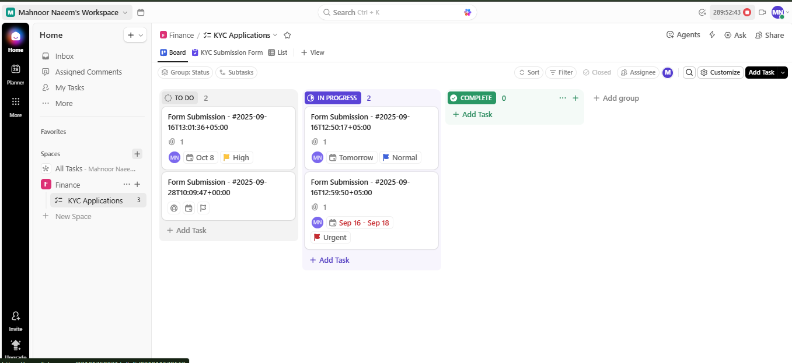
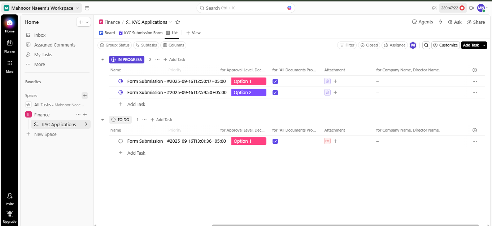
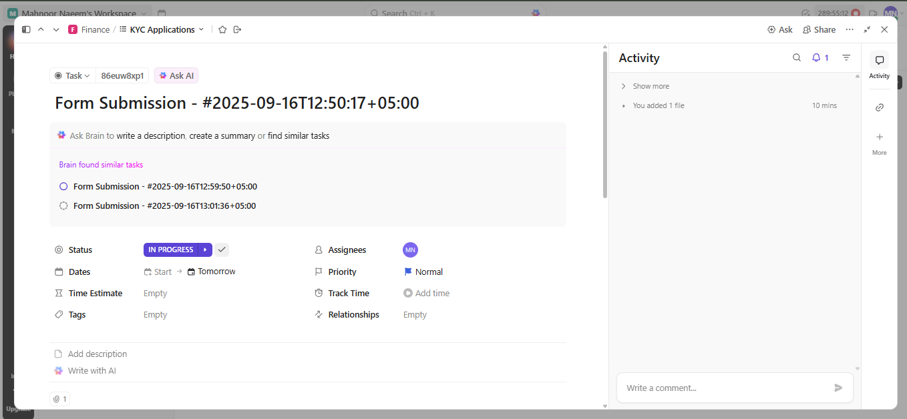

# 🏦 Finance KYC Application Workflow Documentation

## 📄 Overview

This repository documents the structured workflow for managing **Know Your Customer (KYC) Applications** within a dedicated project management platform (like ClickUp).

It provides a scalable, visual framework for the **Finance** team to manage, track, and process form submissions through defined stages, ensuring compliance and efficient review.

---

## ✨ Workflow Components

The workflow is established within a dedicated **Finance Space** and utilizes a nested structure to organize application tasks.

### 1. Finance Workspace Dashboard

The main dashboard provides an executive-level overview of the team's workload, resource allocation, and key recent activity. The **Workload by Status** chart is critical for capacity planning.

---

### 2. KYC Applications Board View

This is the **visual Kanban-style board** that represents the real-time status of all KYC applications.  
Tasks are separated into columns (`TO DO`, `IN PROGRESS`, `COMPLETE`) and can be dragged between stages.

**Key features in this view include:**
* **Task Cards:** Each card represents a customer form submission.
* **Priorities & Deadlines:** Clearly displayed on each card (`High`, `Normal`, `Urgent`) with due dates.
* **Attachments & Assignee:** Visible at a glance for easy tracking.
* **Columns:**  
  - **TO DO** → New applications awaiting review.  
  - **IN PROGRESS** → Applications under active review.  
  - **COMPLETE** → Fully reviewed and approved applications.  

---

### 3. KYC Applications List View

This is the primary operational view for the team. Tasks are grouped by their current **Status** (`IN PROGRESS` or `TO DO`), allowing for easy prioritization and assignment.

**Key features in this view include:**
* **Status Grouping:** Separates tasks awaiting review (`TO DO`) from those actively being processed (`IN PROGRESS`).
* **Custom Fields:** Visible columns for `Approval Level` and `Attachment` status for quick compliance checks.
* **Priority:** Clearly marked priority (Normal, High, Urgent) on each task.

---

### 4. Task Detail: In Progress Status

The detailed task view shows the complete context of an application actively under review.

**Important Task Details:**
* **Status:** `IN PROGRESS`
* **Priority:** `Normal`
* **Assignee:** The team member responsible for the review (MN).
* **Custom Fields:** Options selected for `Approval Level` and `Attachment`.

---

### 5. Task Detail: To Do Status

This view represents an application that has been submitted and is awaiting assignment and initial review.

**Important Task Details:**
* **Status:** `TO DO`
* **Priority:** `High`
* **Due Date:** Start and Due Dates are clearly marked.

---

## 🛠️ Implementation Notes

* **Platform:** Designed using a platform such as ClickUp, but the principles are transferable.
* **Naming Convention:** Task names (`Form Submission - #YYYY-MM-DDTHH:MM:SS`) use a timestamp for unique identification and easy tracking.
* **Goal:** To transform a complex, document-heavy process into a trackable, transparent, and manageable workflow.
  
---

## ❓ Project Q&A

This section addresses key questions regarding the project's necessity, purpose, and documentation standards.

### **1. What is the fundamental purpose of this project?**

The fundamental purpose is to **standardize, track, and streamline the KYC application review process** for the Finance team. It acts as a mandatory workflow and audit trail, ensuring every application is properly vetted for compliance before being approved.

### **2. Why is this project important (Does it have purpose)?**

Yes, the project has a crucial purpose driven by regulatory requirements:

* **Compliance:** KYC is mandatory for financial institutions to prevent **money laundering, terrorist financing, and fraud**. This workflow ensures all regulatory steps are followed and documented.
* **Efficiency:** It significantly reduces the time taken to onboard new customers by providing immediate transparency and reducing delays and rework.
* **Auditability:** It provides management and auditors with a clear, timestamped record of every action taken on an application.

### **3. What are the recommended names for the accompanying screenshots?**

For clarity and documentation purposes, the original screenshot files were renamed to be descriptive of their content, as used in this document:

| Original File Name (Examples) | New Recommended File Name | Content Shown |
| :--- | :--- | :--- |
| `finance.png`, `finance3.png` | `workspace-overview.png` | The main Space dashboard, including the Workload chart. |
| `inprogress.png`, `inprogress2.png` | `kyc-list-view.png` | The List View showing tasks grouped by `TO DO` and `IN PROGRESS`. |
| `form_submission.png`, `status_inprogress.png` | `task-inprogress-details.png` | The detailed view of an individual task currently under review. |
| `todo.png` | `task-todo-details.png` | The detailed view of an application awaiting review. |
| `board.png` | `board.png` | The Kanban-style Board View showing TO DO, IN PROGRESS, COMPLETE columns. |
