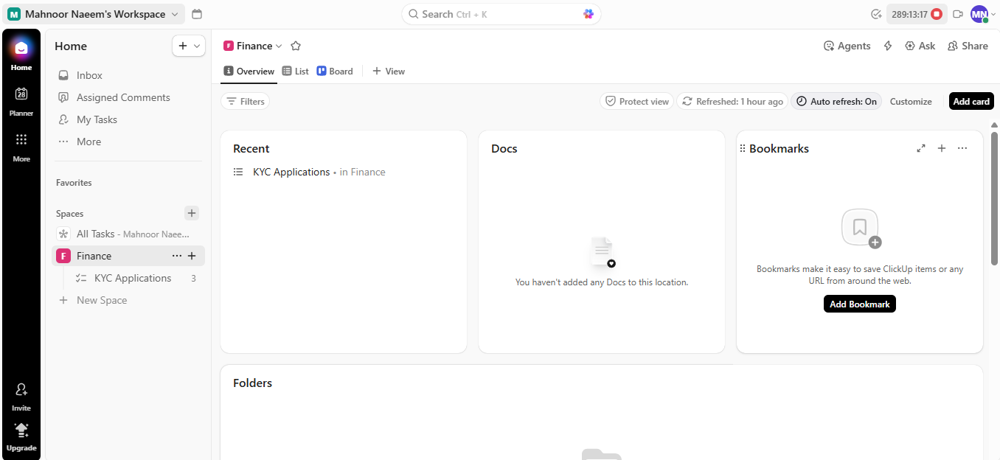
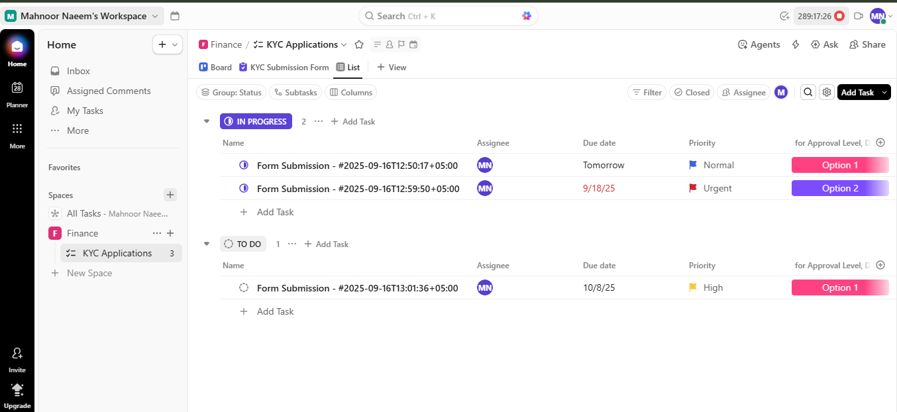
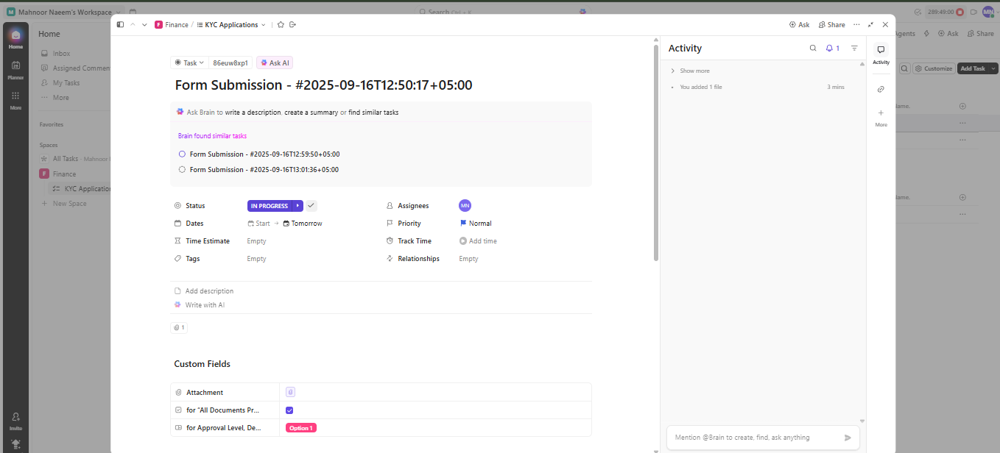
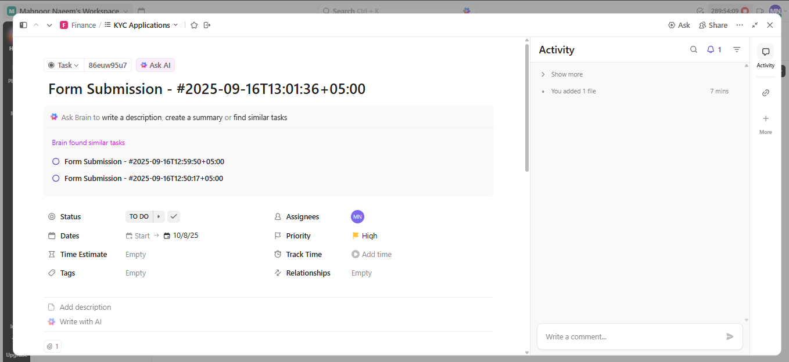

# 🏦 Finance KYC Application Workflow Documentation

## 📄 Overview

This repository documents the structured workflow for managing **Know Your Customer (KYC) Applications** within a dedicated project management platform (like ClickUp).

It provides a scalable, visual framework for the **Finance** team to manage, track, and process form submissions through defined stages, ensuring compliance and efficient review.

---

## ✨ Workflow Components

The workflow is established within a dedicated **Finance Space** and utilizes a nested structure to organize application tasks.

### 1. Finance Workspace Dashboard

The main dashboard provides an executive-level overview of the team's workload, resource allocation, and key recent activity. The **Workload by Status** chart is critical for capacity planning.

### 2. KYC Applications List View

This is the primary operational view for the team. Tasks are grouped by their current **Status** (`IN PROGRESS` or `TO DO`), allowing for easy prioritization and assignment.

**Key features in this view include:**
* **Status Grouping:** Separates tasks awaiting review (`TO DO`) from those actively being processed (`IN PROGRESS`).
* **Custom Fields:** Visible columns for `Approval Level` and `Attachment` status for quick compliance checks.
* **Priority:** Clearly marked priority (Normal, High, Urgent) on each task.

### 3. Task Detail: In Progress Status

The detailed task view shows the complete context of an application actively under review.

**Important Task Details:**
* **Status:** `IN PROGRESS`
* **Priority:** `Normal`
* **Assignee:** The team member responsible for the review (MN).
* **Custom Fields:** Options selected for `Approval Level` and `Attachment`.

### 4. Task Detail: To Do Status

This view represents an application that has been submitted and is awaiting assignment and initial review.

**Important Task Details:**
* **Status:** `TO DO`
* **Priority:** `High`
* **Due Date:** Start and Due Dates are clearly marked.

---

## 🛠️ Implementation Notes

* **Platform:** Designed using a platform such as ClickUp, but the principles are transferable.
* **Naming Convention:** Task names (`Form Submission - #YYYY-MM-DDTHH:MM:SS`) use a timestamp for unique identification and easy tracking.
* **Goal:** To transform a complex, document-heavy process into a trackable, transparent, and manageable workflow.
